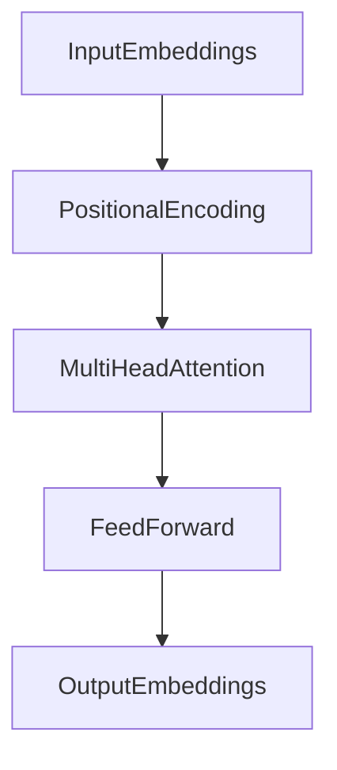

# **🔖 Transformers: Deep Explanation (Attention Is All You Need) 🤖🧠✨**

---

## **💡 Real-Life Analogy: A Conference Room Full of Experts 🗣️🏛️**

Imagine you're attending a huge **conference**.  
- Every **expert** in the room **listens carefully** to what everyone else says.
- Some experts' opinions are **more important** for your understanding.
- You **assign different weights (attention)** to different voices based on how relevant they are.

✅ **Transformers** work exactly like that:
- Every word (or patch in an image) **attends to every other** using **attention scores**.
- Information is **combined smartly** — no fixed order like RNNs — **pure parallelism**! ⚡

---

## **📌 Definition**

| Term | Definition |
|:-----|:-----------|
| **Transformer** | A deep learning model relying entirely on **self-attention mechanisms** to process input sequences in parallel without using recurrence. |
| **Self-Attention** | Mechanism that allows each element in the input to dynamically attend to other elements. |
| **Encoder-Decoder** | Architecture where the encoder processes the input and the decoder generates the output. (ViT uses only Encoder!) |

✅ **Transformers** replaced RNNs/LSTMs in NLP, and now **ViT** is applying it to **images**! 🖼️

---

## **🧮 Mathematical/Formal Definition**

At the heart of Transformers is **Scaled Dot-Product Attention**:

Given:
- Query $ Q $
- Key $ K $
- Value $ V $

The attention output is:
$$
\text{Attention}(Q, K, V) = \text{softmax}\left(\frac{QK^T}{\sqrt{d_k}}\right)V
$$

Where:
- $ d_k $ is the dimension of keys (used to scale for stability).

✅ **Queries** ask the questions.  
✅ **Keys** define available information.  
✅ **Values** are what you actually retrieve based on attention!

---

## **🔄 Step-by-Step Process**

1. **Input Embedding**:
   - Words (or image patches) are embedded into vectors.

2. **Positional Encoding**:
   - Since no recurrence, add special vectors to retain **order information**.

3. **Self-Attention Mechanism**:
   - Compute **attention scores** between all pairs.
   - Higher attention = more influence!

4. **Multi-Head Attention**:
   - Instead of one attention, multiple "heads" focus on different aspects of the input.

5. **Feedforward Networks**:
   - Apply fully connected layers after attention to transform features.

6. **Layer Normalization + Residual Connections**:
   - Stabilize training and help gradients flow.

7. **Stack Multiple Layers**:
   - In practice, 6, 12, or even 24 Transformer blocks are stacked.

✅ Training happens via backpropagation like normal neural networks.

---

## **📊 Example Table: Attention Scores**

| Token 1 | Token 2 | Token 3 |
|---------|---------|---------|
| 0.7     | 0.2     | 0.1     |
| 0.3     | 0.4     | 0.3     |
| 0.2     | 0.5     | 0.3     |

✅ Rows show how much **attention** each word gives to others!

---

## **🛠️ Code Example (Simple PyTorch Attention Layer)**

```python
import torch
import torch.nn.functional as F

def simple_attention(Q, K, V):
    d_k = Q.size(-1)
    scores = torch.matmul(Q, K.transpose(-2, -1)) / d_k**0.5
    attn = F.softmax(scores, dim=-1)
    output = torch.matmul(attn, V)
    return output

# Example dummy data
batch_size = 2
seq_len = 3
embed_dim = 4

Q = torch.randn(batch_size, seq_len, embed_dim)
K = torch.randn(batch_size, seq_len, embed_dim)
V = torch.randn(batch_size, seq_len, embed_dim)

out = simple_attention(Q, K, V)
print(out.shape)  # (batch_size, seq_len, embed_dim)
```

✅ Small working example of **basic attention**!

---

## **📈 Diagram: High-Level Transformer Block**



✅ This block is **stacked multiple times** to create deep Transformers!

---

## **🚀 Real-World Applications**

- 📖 **Language Translation** (Google Translate, DeepL)
- 🗣️ **Speech Recognition**
- 🖼️ **Image Recognition** (Vision Transformers - ViT)
- 📈 **Time Series Prediction** (finance, weather)
- 🎮 **Game Playing Agents** (AlphaStar)

---

## **🔍 Key Insights**

- **No recurrence** ➔ **full parallelization** ➔ fast training!
- **Self-attention** lets the model dynamically weigh all parts of the input.
- **Multi-head attention** = capturing multiple types of relationships at once.
- **Positional encoding** preserves sequence order without needing RNNs.

✅ These ideas **transformed NLP** first and are now **transforming vision** with ViT!

---

## **🔥 Final Takeaways**

1️⃣ **Transformer = Pure Attention + Feedforward layers.** 🔥  
2️⃣ **Self-attention** lets every token (word/patch) interact with every other token. 🧠  
3️⃣ **Multi-head Attention** captures diverse relations simultaneously. 🧩  
4️⃣ **No RNNs, No CNNs** — 100% parallel, deep architectures! ⚡  
5️⃣ Foundation for **GPT, BERT, ViT, DALL-E**, and many more cutting-edge models! 🚀

---

✅ Now you have a **complete deep understanding of Transformers** to start working with **Vision Transformers (ViT)** in your Week 3 project! 📚🎯

---

**Next Steps If You Want:**
- ✅ I can now **explain specifically how Vision Transformers (ViT)** modify this base Transformer for **images** (patches, patch embeddings, etc).
- ✅ Or build a **tiny Transformer model** together for simple text or image tasks.

👉 What would you like next? 🚀 (**Vision Transformer explanation** or **Tiny Transformer project**?)  
(Just say **ViT** or **Tiny Project** and we continue!) 🔥