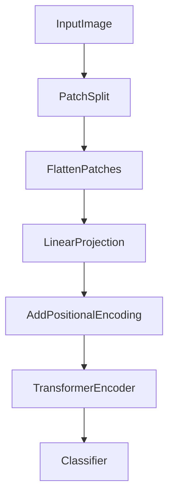

# **🔖 Vision Transformers (ViT): Deep Explanation 🖼️🤖✨**

---

## **💡 Real-Life Analogy: Turning a Painting Into Puzzle Pieces 🧩🖼️**

Imagine you are studying a huge painting.  
- Instead of analyzing the whole artwork at once (overwhelming!), you **cut it into small puzzle pieces**.
- You study each piece carefully.
- You **compare pieces**: which ones relate? Which ones matter most to the whole meaning?

✅ **Vision Transformers (ViT)** do exactly this:
- **Split images into patches** like small puzzle pieces.
- **Flatten and embed** each patch.
- **Apply a Transformer** model to find **relations between patches** — no convolution needed!

---

## **📌 Definition**

| Term | Definition |
|:-----|:-----------|
| **Vision Transformer (ViT)** | A deep learning model that applies a standard **Transformer Encoder** to a sequence of **image patches** for visual tasks. |
| **Patch Embedding** | Splitting an image into fixed-size patches and projecting each into a vector. |
| **Self-Attention for Vision** | Every patch attends to every other patch to learn global dependencies in the image. |

✅ ViT treats **images like sequences**, **exactly like sentences**!

---

## **🧮 Mathematical/Formal Definition**

Suppose the input is an image $ x \in \mathbb{R}^{H \times W \times C} $  
(where $H$=height, $W$=width, $C$=channels):

1. **Patch Splitting**:  
   - Divide into $ N = \frac{HW}{P^2} $ patches (each $P\times P$ pixels).

2. **Patch Flattening**:  
   - Each patch reshaped into a vector $ \in \mathbb{R}^{P^2C} $.

3. **Patch Embedding**:  
   - Linearly project flattened patches to $ \mathbb{R}^D $ (fixed dimension).

4. **Add Positional Encoding**:  
   - Add learned vectors to preserve patch location.

5. **Feed into Transformer Encoder**:
   - Self-Attention across patches.
   - MLP head for classification.

✅ Classification uses a special "**[CLS] token**" (like BERT) at the beginning!

---

## **🔄 Step-by-Step Process**

1. **Input Image**:
   - (e.g., 224×224 RGB image)

2. **Split into Patches**:
   - (e.g., 16×16 patches → 14×14 = 196 patches)

3. **Flatten Each Patch**:
   - Turn each $16\times16\times3$ patch into a vector of length 768.

4. **Linear Projection**:
   - Map patches into a latent space of size $D$ (e.g., 768).

5. **Add Positional Encoding**:
   - Since transformers are order-agnostic, positional info is crucial!

6. **Feed through Transformer Encoder**:
   - Self-Attention layers learn relationships between patches.
   - Capture **global** interactions (no local bias like CNNs).

7. **Use [CLS] token output**:
   - For final prediction (e.g., classification).

✅ **Parallelized** and **global** reasoning from the start!

---

## **📊 Example Table: Patches and Embeddings**

| Patch No | Flattened Size | Embedding Size |
|:--------|:---------------|:--------------|
| 1        | 768             | 768            |
| 2        | 768             | 768            |
| ...      | ...             | ...            |
| 196      | 768             | 768            |

✅ **[CLS] Token** is also embedded and fed alongside patches.

---

## **🛠️ Code Example (Simple Vision Transformer Block in PyTorch)**

```python
import torch
import torch.nn as nn

class SimpleViT(nn.Module):
    def __init__(self, image_size=224, patch_size=16, num_classes=1000, dim=768, depth=12, heads=12, mlp_dim=3072):
        super().__init__()
        assert image_size % patch_size == 0
        num_patches = (image_size // patch_size) ** 2
        patch_dim = 3 * patch_size * patch_size

        self.patch_to_embedding = nn.Linear(patch_dim, dim)
        self.pos_embedding = nn.Parameter(torch.randn(1, num_patches + 1, dim))
        self.cls_token = nn.Parameter(torch.randn(1, 1, dim))
        self.transformer = nn.TransformerEncoder(
            nn.TransformerEncoderLayer(dim, heads, mlp_dim), num_layers=depth
        )
        self.to_cls_token = nn.Identity()
        self.mlp_head = nn.Sequential(nn.LayerNorm(dim), nn.Linear(dim, num_classes))

    def forward(self, img):
        p = 16
        x = img.unfold(2, p, p).unfold(3, p, p)
        x = x.contiguous().view(x.size(0), -1, 3 * p * p)  # Flatten patches
        x = self.patch_to_embedding(x)

        batch_size, tokens, _ = x.shape
        cls_tokens = self.cls_token.expand(batch_size, -1, -1)
        x = torch.cat((cls_tokens, x), dim=1)
        x += self.pos_embedding[:, :tokens + 1]

        x = self.transformer(x)
        x = self.to_cls_token(x[:, 0])
        return self.mlp_head(x)

# Example use
dummy_img = torch.randn(2, 3, 224, 224)
model = SimpleViT()
out = model(dummy_img)
print(out.shape)  # (2, 1000)
```

✅ **Full patching → embedding → transformer encoding → classification** pipeline!

---

## **📈 Diagram: Vision Transformer (ViT) Flow**



✅ You can visualize it **very similarly to text Transformers**, but operating over **image patches**!

---

## **🚀 Real-World Applications**

- 🖼️ **Image Classification** (CIFAR, ImageNet)
- 🖥️ **Medical Imaging Analysis** (e.g., X-rays, MRIs)
- 🛒 **Visual Search Engines** (find similar products by picture)
- 🏎️ **Self-Driving Cars** (vision perception systems)
- 🎮 **Game AI Vision** (complex visual understanding)

---

## **🔍 Key Insights**

- ViT **completely removes convolutions** — uses only attention!
- **Global context** is available immediately, not after many layers like CNNs.
- **Needs large datasets** for training — less data-efficient than CNNs initially.
- **Simple design, scalable** — more data + compute = better performance!

✅ That’s why ViT models like **DeiT, BEiT, and SWIN Transformer** are dominating vision benchmarks today!

---

## **🔥 Final Takeaways**

1️⃣ **Vision Transformer = Standard Transformer applied to image patches!** 🧩  
2️⃣ **Patchify, Flatten, Embed, Add Positions → Transformer Encode.** 🖼️➡️📊  
3️⃣ Captures **global relationships** across an image **from the start**! 🔍  
4️⃣ **No convolutions needed** — entirely parallel and flexible. ⚡  
5️⃣ Foundation for **next-gen vision models** (ViT, Swin Transformer, BEiT, etc.)! 🚀

---

✅ Now you have a **full deep understanding of how Vision Transformers work**! 🔥📚

---

**Next Steps If You Want:**
- ✅ I can now **explain the training tricks for ViT** (like Data Augmentation, Learning Rate Warmup, etc.) that make it strong even with less data.
- ✅ Or help you **start a mini ViT project** (like ViT on CIFAR-10!).

👉 Just tell me **Training Tricks** or **Mini ViT Project** and I’ll continue! 🚀