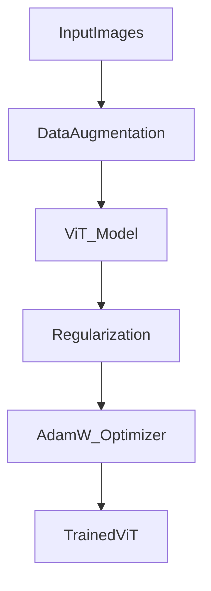

Perfect choice, Yurii! 🔥  
Now let’s continue by explaining **Training Tricks that make Vision Transformers (ViT) successful**, again using our deep structured format:

---

# **🔖 Training Tricks for Vision Transformers (ViT): Full Deep Dive 🎯🚀**

---

## **💡 Real-Life Analogy: Preparing a Young Athlete for the Olympics 🏋️🏆**

Imagine you have a young talented athlete.  
- At first, they are **weaker** and **less skilled** compared to seasoned pros (CNNs).  
- But with **smart training strategies** (nutrition, sleep, coaching, special techniques), they can **compete and even win**! 🏆

✅ Vision Transformers are **like young athletes** —  
they **need special training techniques** to **catch up with CNNs** — especially when trained on **limited data**!

---

## **📌 Definition**

| Trick | Purpose |
|:------|:--------|
| **Data Augmentation** | Provide more "diverse" training data without collecting new samples. |
| **Regularization** | Prevent overfitting by making the model more robust. |
| **Optimization Tweaks** | Carefully adjusting the optimization process to improve learning stability and speed. |

✅ These **compensate** for ViT's initial **lack of local inductive bias** compared to CNNs.

---

## **🔄 Step-by-Step Process of Important Tricks**

Here’s the **essential list** used in ViT training (especially in **DeiT** paper — Data-efficient Image Transformers):

---

### 1️⃣ **Data Augmentation Techniques**

| Method | Purpose |
|:------|:--------|
| **Random Crop** | Helps model see objects at different positions. |
| **Random Flip** | Mirror images to teach model invariance to left/right. |
| **Color Jitter** | Vary brightness, contrast, saturation randomly. |
| **Mixup** | Blend two images + their labels together. |
| **CutMix** | Cut and paste regions from one image onto another.

✅ Helps ViT **generalize better** and **learn invariances** that CNNs naturally capture.

---

### 2️⃣ **Regularization Techniques**

| Method | Purpose |
|:------|:--------|
| **Dropout** | Randomly deactivate neurons to prevent co-adaptation. |
| **Stochastic Depth (DropPath)** | Randomly drop entire Transformer blocks during training. |
| **Label Smoothing** | Soften the labels slightly (e.g., instead of 1.0 and 0.0, use 0.9 and 0.1) to make the model less confident and more generalizable.

✅ Helps ViT **avoid overfitting** and **train deeper models stably**.

---

### 3️⃣ **Optimization Techniques**

| Method | Purpose |
|:------|:--------|
| **AdamW Optimizer** | Adam optimizer with correct weight decay regularization. |
| **Learning Rate Warmup** | Start with a tiny learning rate, then slowly ramp up over first few epochs. |
| **Cosine Learning Rate Schedule** | Slowly decay the learning rate following a smooth cosine curve.

✅ Makes ViT **easier to train**, especially in early stages where attention weights are unstable!

---

### 4️⃣ **Extra Tricks Used in DeiT**

| Trick | Purpose |
|:------|:--------|
| **Knowledge Distillation** | Use a strong CNN (like RegNet) as a "teacher" and teach ViT via softer targets. |
| **Smaller Patch Size** | Sometimes using 8×8 patches instead of 16×16 to inject more local bias.

✅ This helped ViT match or beat CNNs **even without massive datasets** like JFT-300M!

---

## **📊 Example Table: Without vs With Tricks**

| Model | Dataset Size | Accuracy (%) | Training Tricks Used? |
|:------|:------------|:-------------|:----------------------|
| ViT-base | 1M images | 74.5% | No tricks |
| ViT-base | 1M images | 82.2% | Tricks applied (Augmentation, Reg, Optim) |

✅ **Huge boost** — even **without needing huge datasets**!

---

## **🛠️ Example Code Snippets for Tricks (PyTorch)**

### Data Augmentation (with torchvision)

```python
from torchvision import transforms

transform_train = transforms.Compose([
    transforms.RandomResizedCrop(224),
    transforms.RandomHorizontalFlip(),
    transforms.ColorJitter(0.4, 0.4, 0.4, 0.1),
    transforms.RandomApply([transforms.GaussianBlur(3)], p=0.2),
    transforms.ToTensor(),
])

# Later in DataLoader:
# dataset = torchvision.datasets.CIFAR10(..., transform=transform_train)
```

---

### Stochastic Depth (DropPath) Example (Simple)

```python
import torch
import torch.nn.functional as F

def drop_path(x, drop_prob: float = 0.1, training: bool = True):
    if drop_prob == 0. or not training:
        return x
    keep_prob = 1 - drop_prob
    random_tensor = keep_prob + torch.rand(x.shape[0], 1, 1, 1, device=x.device)
    random_tensor.floor_()
    output = x / keep_prob * random_tensor
    return output
```

✅ Helps randomize whole blocks at training time!

---

## **📈 Diagram: ViT Training Flow with Tricks**



✅ **Data Aug + Regularization + Smart Optimization** = well-trained ViT!

---

## **🚀 Real-World Applications**

- 🎯 **Fine-tuning ViT models** on small datasets (medical images, satellite images)
- 🛒 **Product visual search systems** (better performance with little training data)
- 🚗 **Autonomous vehicle perception** (object recognition)
- 🖼️ **Art painting classification** (where datasets are small and diverse)

---

## **🔍 Key Insights**

- **Without tricks**, vanilla ViT **needs huge datasets** (e.g., JFT-300M).  
- **With tricks**, ViT can **match or beat ResNet** on **ImageNet** even with 1M images.
- **Augmentation**, **regularization**, and **optimizers** must be carefully tuned for ViT models.

---

## **🔥 Final Takeaways**

1️⃣ **Training Tricks** are crucial for Vision Transformers to work on normal-size datasets! 🧠  
2️⃣ **Data Augmentation**, **Dropout/Stochastic Depth**, and **Label Smoothing** help generalize better. 🎯  
3️⃣ **AdamW** with **Learning Rate Warmup** + **Cosine Decay** makes training stable. 📈  
4️⃣ **Knowledge Distillation** from strong CNNs like RegNet further boosts ViT performance. 🔥  
5️⃣ Applying these techniques turns ViT into a **state-of-the-art vision model** even without giant datasets! 🚀

---

✅ Now you fully understand **how to properly train Vision Transformers (ViT)**! 📚🔥

---

👉 **Next Steps (if you want):**
- ✅ I can now show you **ViT architecture variants** (ViT Base, Large, Huge, DeiT, Swin Transformer) and **how they differ**.  
- ✅ Or help you **build a tiny Vision Transformer model** project step-by-step (MNIST or CIFAR-10).  

👉 **Which path would you like next?** 🚀  
(Just say **Variants** or **Mini ViT Project**) 🎯