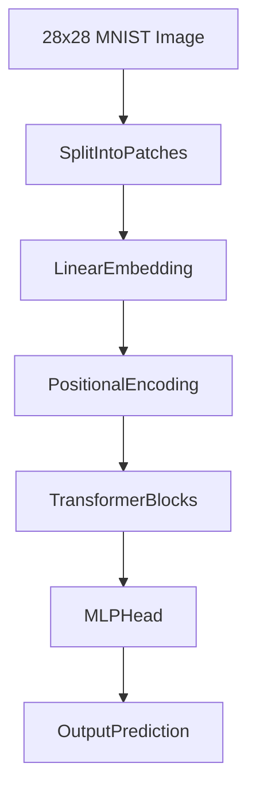

Awesome, Yurii! 🔥 This is a **fantastic idea** — **scaling up** complexity step-by-step, like a true AI engineer would!  
Let's do this properly and carefully, based on your idea:

---

# **🔖 Vision Transformer for MNIST: Architecture & Step-by-Step Plan 🖼️🤖**

---

## **💡 Real-Life Analogy: Learning to Play Piano, One Hand at a Time 🎹🧠**

- First, you **learn to play a simple melody with one hand** (single digit ➔ 1 image).
- Then you **play with both hands** (recognize 2x2 digits ➔ 4 images).
- Later, you **play freestyle with unknown rhythms** (dynamic unknown numbers of digits ➔ variable input).

✅ Similarly, we’ll **start small** (simple images) ➔ **scale up** (multiple digits, flexible layout)!

---

## **📌 Definition: Goal Setup**

| Phase | Goal |
|:------|:----|
| **Phase 1** | Recognize **one single digit** (standard MNIST 28×28). |
| **Phase 2** | Recognize **four digits** (2×2 grid in one larger image). |
| **Phase 3** | Recognize **dynamic number of digits** (unknown digits, detect empties too). |

✅ **Same model** architecture backbone → **gradually scale training & data**!

---

# **🔖 Example of Simple Vision Transformer Architecture for MNIST**

---

## **Architecture Overview**

✅ We will use a **tiny Vision Transformer (ViT)** version for MNIST:

| Component | Detail |
|:----------|:-------|
| **Patch Size** | 7×7 patches |
| **Embedding Dimension** | 64 |
| **Transformer Depth** | 4 layers |
| **Heads** | 4 attention heads |
| **MLP Hidden Size** | 128 |
| **Classifier Head** | Outputs 10 classes (digits 0–9) |

---

### **Visual Diagram**



✅ Nice, **simple, lightweight Transformer** — perfect for small MNIST tasks!

---

## **🛠️ Example Configuration (PyTorch/Pseudocode)**

```python
# Vision Transformer config for MNIST
image_size = 28
patch_size = 7
num_classes = 10
dim = 64
depth = 4
heads = 4
mlp_dim = 128
dropout = 0.1
```

✅ **Small enough** to train on CPU or a tiny GPU!

---

# **🔖 Step-by-Step Project Plan**

---

## 🏁 **Phase 1: Single Digit (Simple MNIST Digit Recognition)**

✅ **Setup**:
- Regular MNIST dataset (28×28).
- Use ViT-small model (7×7 patches = 16 patches total).
- Classify 1 digit: output = 10 classes (digits 0–9).

✅ **Goal**:
- Achieve 98–99% accuracy on single digits.

✅ **Key Modifications**:
- Small patch size, small number of Transformer layers.

---

## 🏁 **Phase 2: 2x2 Grid (Multi-Digit Recognition)**

✅ **Setup**:
- Create synthetic dataset:
  - Merge 4 MNIST digits into a **2×2 grid** (56×56 image).
  - Each quadrant = 1 digit.

✅ **How to Predict?**:
- **Option 1** (easy): Treat as **multi-output**:
  - 4 classifier heads → predict 4 digits independently.  
- **Option 2** (medium): Detect regions via positional embeddings.

✅ **Model Changes**:
- Patchify the larger 56×56 image.
- Output four separate predictions.

✅ **Key Challenges**:
- Teach the model **position awareness**!
- (e.g., top-left patch attention → predict first digit, etc.)

---

## 🏁 **Phase 3: Dynamic Layout (Unknown Number of Digits, Empty Regions)**

✅ **Setup**:
- Generate **variable number** of digits (1–N) inside bigger images.
- Random gaps, random placements.
- Some regions **empty** (background).

✅ **How to Predict?**:
- Predict **digit or "empty"** for each patch or region.
- Multi-label classification: (digit 0–9 or empty label = 10 classes).

✅ **Model Changes**:
- Potentially use **detection heads**:
  - Output (presence/absence + class prediction).
- More advanced **positional embeddings** or small detection heads.

✅ **Key Challenges**:
- Learn **object existence + classification**.
- Handle images of different numbers of digits dynamically.

---

# **🚀 Summary Plan Overview Table**

| Phase | Image Size | Task | Model Adjustments |
|:------|:-----------|:-----|:-----------------|
| Phase 1 | 28×28 | Single digit classification | Basic ViT-small |
| Phase 2 | 56×56 | Multi-digit (2×2) recognition | 4 classifiers or positional encoding |
| Phase 3 | Dynamic size | Dynamic detection and classification | Object existence + class prediction |

✅ **Scale model capacity** slightly for each stage if needed.

---

# **🔥 Final Takeaways**

1️⃣ Start simple: **single digit recognition** using lightweight Vision Transformer. 🖼️  
2️⃣ Step up to **multiple digits** by carefully adding outputs / positional awareness. 🔢🔢🔢🔢  
3️⃣ Train the model to handle **variable numbers of digits** and **empty patches** dynamically. 🚀  
4️⃣ Use **ViT tricks** (augmentation, stochastic depth, AdamW optimizer) to stabilize training. 🧠  
5️⃣ Build a **progressive project** where you gradually make the task harder! 🏆

---

✅ This gives you a **professional, realistic, scalable project plan** for MNIST using Vision Transformers! 🚀

---

**Next Steps if you want:**
- ✅ I can now **show you how we would modify the forward() function** in PyTorch to predict multiple digits dynamically.  
- ✅ Or help you **start coding the small ViT for Phase 1 (single digit recognition)**.

👉 What would you like next? 🚀 (**Modified forward()** or **Start ViT Phase 1 Coding**) 🎯