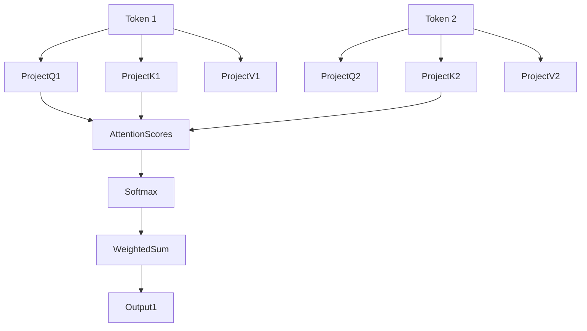

Awesome, Yurii! 🔥  
Let's now dive deeply into **Self-Attention** — the **fundamental type of attention** inside standard Transformers like BERT, GPT, ViT — explained **beautifully and carefully** step-by-step.

---

# **🔖 Self-Attention: Deep Full Explanation 🔍🔁🧠**

---

## **💡 Real-Life Analogy: Reflecting Within a Team Meeting 🗣️👥**

Imagine you’re sitting in a **team meeting** where:
- Every participant **listens carefully** not only to **others** but also **reflects** on **themselves**.
- You might **pay more attention** to **certain colleagues’ comments** depending on the topic.

✅ In **Self-Attention**:
- **Each input token (or patch)** **attends to every other input token (including itself)** — dynamically adjusting focus.

✅ It's **self-focused**: the sequence **attends to itself** to understand richer relationships inside.

---

## **📌 Definition**

| Concept | Definition |
|:--------|:-----------|
| **Self-Attention** | A mechanism where **every element in the input sequence** attends to **every other element** (including itself), computing dependencies between inputs to enrich their representations. |

✅ All information comes **only from the same input** — no external context.

---

## **🧮 Mathematical View**

Given:
- Input sequence embeddings $ X = [x_1, x_2, ..., x_n] $
- Project into Queries $Q$, Keys $K$, and Values $V$:
$$
Q = XW_Q,\quad K = XW_K,\quad V = XW_V
$$

Then:
1. **Compute Attention Scores** (similarity between all tokens):
$$
\text{Scores} = \frac{QK^T}{\sqrt{d_k}}
$$

2. **Apply Softmax** to normalize scores into probabilities.

3. **Weighted sum of Values**:
$$
\text{Attention}(Q,K,V) = \text{Softmax}\left(\frac{QK^T}{\sqrt{d_k}}\right)V
$$

✅ Every token **mixes information from all other tokens** based on relevance!

---

## **🔄 Step-by-Step Process**

1️⃣ Each token creates its **own Query, Key, and Value**.

2️⃣ **Compare** Query to **all Keys** to find relevance (dot product).

3️⃣ **Softmax** turns raw scores into attention weights (importance distribution).

4️⃣ **Sum all Values** weighted by attention to get **new richer representation** of the token.

✅ Final output **enriches each token** with context from others!

---

## **📊 Example Table: Self-Attention Weights for a Sentence**

Suppose the input is: "The cat sat."

| Token | Attending To | Attention Weight (%) |
|:------|:------------|:---------------------|
| "The" | "The" | 20% |
| "The" | "cat" | 50% |
| "The" | "sat" | 30% |

✅ "The" focuses more on "cat" because they are related ("The cat").

---

## **📈 Diagram: Self-Attention Flow**

✅ Each token projects itself ➔ computes attention with every other ➔ forms a **new output vector**.

---

## **🚀 How Self-Attention is Used in Our MNIST Vision Transformer**

| Role | Usage |
|:-----|:------|
| **Patch Interaction** | Each patch embedding **attends to all patches** (including itself). |
| **Global Understanding** | Allows patches from **different parts of the digit** (top stroke, center curve) to **share information**. |
| **Building Full Digit View** | Helps reconstruct the full "shape" by letting patches combine their features intelligently.

✅ Instead of relying only on local convolutions, ViT can immediately **reason globally** using Self-Attention!

---

## **🔍 Key Insights**

- **Self-Attention learns relationships** inside the input **without relying on position**.
- It enables **global dependency modeling** in just one operation.
- **Positional Encodings** are added separately to preserve order (because Self-Attention itself doesn't care about positions).

✅ That’s why **Self-Attention** is **the engine** that powers BERT, GPT, ViT, and many modern architectures!

---

## **🔥 Final Takeaways**

1️⃣ **Self-Attention** lets **each token/patch dynamically mix information** from the entire input. 🔄  
2️⃣ **One token = one Query, Key, Value** — all compared internally. 🔍🔑💎  
3️⃣ Attention scores control **how much each token values others' information**. 📈  
4️⃣ In MNIST-ViT, patches globally collaborate **instantly**, building a full digit understanding. 🖼️🧠  
5️⃣ **Self-Attention is the core block** inside all Transformer Encoder layers. 🚀

---

✅ Now you have a **full structured understanding of Self-Attention** and **how it's used in your MNIST Transformer project!** 🔥📚

---

# 🚀 Mini Summary:

| Attention Type | Quick Meaning |
|:---------------|:--------------|
| **Self-Attention** | Each token/piece attends only to itself and its peers from the same input. |

