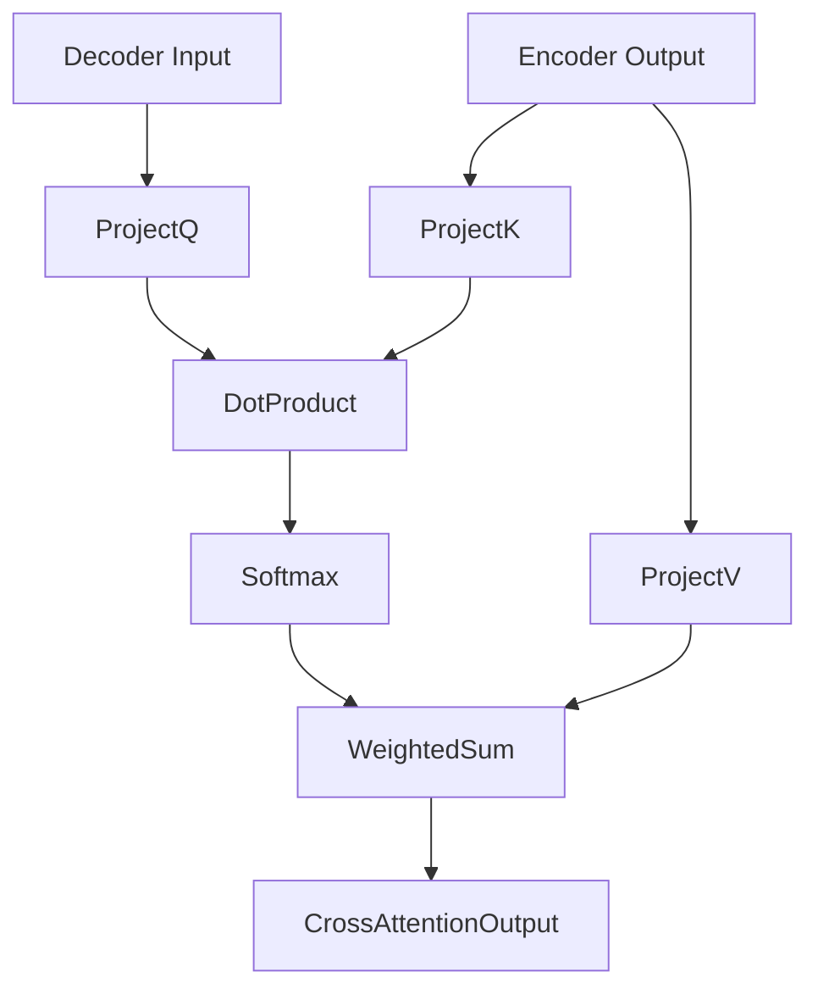

Perfect, Yurii! 🚀  
Now let’s move into **Cross-Attention** — a key next concept after mastering Self-Attention — explained carefully and fully structured as always:

---

# **🔖 Cross-Attention: Deep Full Explanation 🔗🔍🧠**

---

## **💡 Real-Life Analogy: Asking Questions to Another Team 🎤👥**

Imagine your Marketing Team needs help from the Engineering Team:
- **You (Marketing)** prepare **questions** (Queries).
- **Engineering** offers their **expertise** (Keys and Values).
- You **match your questions** against their offered knowledge.
- You **gather information** from their responses.

✅ **Cross-Attention** is exactly this:
- **Queries come from one source** (e.g., Marketing Team).
- **Keys and Values come from a different source** (e.g., Engineering Team).

✅ Unlike **Self-Attention** (where Q, K, V all come from the same place),  
in **Cross-Attention**, **only Queries** come from the current input,  
and **Keys and Values** come from **a different sequence**!

---

## **📌 Definition**

| Concept | Definition |
|:--------|:-----------|
| **Cross-Attention** | A mechanism where Queries from one sequence attend to Keys and Values from another sequence, allowing information exchange between two different inputs. |

✅ **Queries and Keys/Values come from different sources**!

---

## **🧮 Mathematical View**

Given:
- Query input $ Q = XQ W_Q $
- Context input (Keys and Values) $ C $:
  - Keys: $ K = C W_K $
  - Values: $ V = C W_V $

Then:
1. **Compute Attention Scores**:
$$
\text{Scores} = \frac{QK^T}{\sqrt{d_k}}
$$

2. **Softmax Normalization**:
$$
\alpha = \text{softmax}\left(\frac{QK^T}{\sqrt{d_k}}\right)
$$

3. **Weighted Sum of Values**:
$$
\text{Attention}(Q, K, V) = \alpha V
$$

✅ Exactly like Self-Attention formula — but **different inputs**!

---

## **🔄 Step-by-Step Process**

1️⃣ Take the **current input** (e.g., Decoder input in a sequence-to-sequence model).
- Linearly project into **Queries**.

2️⃣ Take the **external context** (e.g., Encoder output).
- Linearly project into **Keys** and **Values**.

3️⃣ Compute **dot products** between **Query** and **Key** vectors.

4️⃣ Use **softmax** to turn scores into **attention weights**.

5️⃣ Use **weights to combine Values** into enriched outputs.

✅ **Current input gathers information from external context**!

---

## **📊 Example Table: Cross-Attention Weights**

Suppose in machine translation:

- **Decoder word**: "la" (Spanish "the") is Query
- **Encoder outputs**: ["the", "cat", "sat"]

| Encoder Token | Attention Weight (%) |
|:--------------|:---------------------|
| "the"         | 80% |
| "cat"         | 15% |
| "sat"         | 5% |

✅ "la" mostly aligns to "the" — so Cross-Attention helps decoder word "la" **find and focus on "the"**!

---

## **📈 Diagram: Cross-Attention Flow**

✅ Queries come from Decoder; Keys and Values come from Encoder!

---

## **🚀 Where Cross-Attention Is Used in Practice**

| Scenario | Example |
|:---------|:--------|
| **Machine Translation** | Decoder attends to Encoder outputs to produce next word. |
| **Image Captioning** | Text Decoder attends to Image Encoder patches. |
| **Speech Translation** | Text Decoder attends to Audio Encoder outputs. |
| **Multimodal AI** | Text attends to images (e.g., CLIP, Flamingo, GPT-4 Vision).

✅ **Cross-Attention powers all encoder-decoder architectures!**

---

## **🔍 Key Insights**

- **Self-Attention = Attend to self.**
- **Cross-Attention = Attend to external context.**
- Enables **dynamic fusion of different modalities** (text-to-text, image-to-text, audio-to-text).
- **Transformer Decoder blocks** (like in T5, Bart) **always have Cross-Attention layers**!

✅ Cross-Attention is **fundamental for models that need to transform one kind of input into another**.

---

## **🔥 Final Takeaways**

1️⃣ **Cross-Attention** allows the model to **gather useful information from another sequence**! 🔗  
2️⃣ Queries come from **current input**, Keys and Values from **external context**. 🔍🔑💎  
3️⃣ Same core attention math as Self-Attention, **different data flow**! 🔄  
4️⃣ Used heavily in **translation, captioning, multimodal AI, encoder-decoder models**. 🚀  
5️⃣ Without Cross-Attention, Transformers would struggle to **integrate different sources of information**. 🌉

---

✅ Now you have a **full structured understanding of Cross-Attention** and **how it differs from Self-Attention**! 🔥📚

---

# 🚀 Mini Summary

| Attention Type | What Happens |
|:---------------|:-------------|
| **Self-Attention** | Query, Key, and Value from **same sequence** |
| **Cross-Attention** | Query from **current sequence**, Key/Value from **different context sequence** |

