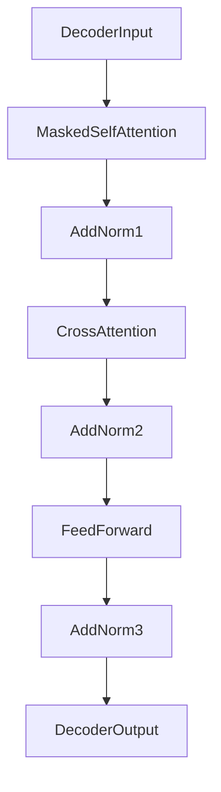

Perfect, Yurii! 🚀  
Now let’s **carefully** and **professionally** build and explain how **Self-Attention and Cross-Attention are combined inside a Transformer Decoder Block** — following full structured style!

---

# **🔖 Transformer Decoder Block Architecture: Full Deep Dive 🏛️🚀**

---

## **💡 Real-Life Analogy: Preparing an International Speech 🗣️🌎**

Imagine you're preparing a speech:
- First, you **re-read your previous sentences** to maintain consistency (Self-Attention).
- Then, you **consult an external report** for facts and updates (Cross-Attention).
- Finally, you **write the next sentence** enriched with both sources.

✅ That’s exactly what a **Decoder Block** does:
- It first **looks at its own previous outputs (Self-Attention)**.
- Then **consults external Encoder outputs (Cross-Attention)**.
- Finally, it **produces enriched information for next predictions**.

---

## **📌 Definition**

| Part | Role |
|:-----|:-----|
| **Masked Self-Attention** | Attend to previous generated tokens (NOT future ones). |
| **Cross-Attention** | Attend to Encoder outputs (contextual knowledge). |
| **Feedforward Layer** | Further transform and enrich representations. |

✅ **Each Decoder Block stacks these three operations!**

---

## **🔄 Step-by-Step Decoder Block Process**

1️⃣ **Masked Self-Attention**:
- The Decoder input attends **only to previous tokens**.
- **Mask** ensures no cheating — can't look into future tokens!

2️⃣ **Cross-Attention**:
- Current Decoder states **attend to full Encoder outputs** (context from input).

3️⃣ **Feedforward Neural Network**:
- Two fully connected layers with non-linear activation (like GELU or ReLU).

4️⃣ **Residual Connections + Layer Normalization**:
- After each block, we add the input to the output (skip connection) and apply LayerNorm.

✅ This stacking ensures **stable training** and **rich contextual flow**!

---

## **🧮 Mathematical View (Formulas)**

Suppose:
- Decoder input embeddings: $ D $
- Encoder output embeddings: $ E $

Then:

1. **Masked Self-Attention**:
$$
D' = \text{SelfAttention}(D, D, D, \text{mask})
$$

2. **Cross-Attention**:
$$
D'' = \text{CrossAttention}(D', E, E)
$$

3. **Feedforward Network**:
$$
\text{Output} = \text{FeedForward}(D'')
$$

✅ **Order matters**: Self-Attention ➔ Cross-Attention ➔ Feedforward!

---

## **📈 Diagram: Full Decoder Block Flow**



✅ Residual (skip) connections added after each major block!

---

## **📊 Table Summary: 3 Key Parts**

| Part | Query | Key | Value | Source |
|:-----|:------|:----|:------|:-------|
| **Masked Self-Attention** | Decoder | Decoder | Decoder | Self |
| **Cross-Attention** | Decoder | Encoder | Encoder | External |
| **Feedforward** | --- | --- | --- | Neural Transformation |

✅ You see clearly:  
- Self-Attention = "How do my own previous tokens help me?"  
- Cross-Attention = "What knowledge can I gather from Encoder?"  
- Feedforward = "How can I further polish my representation?"

---

## **🛠️ Minimal PyTorch-like Pseudocode for Decoder Block**

```python
class TransformerDecoderBlock(nn.Module):
    def __init__(self, dim, heads, ff_dim, dropout=0.1):
        super().__init__()
        self.self_attn = nn.MultiheadAttention(dim, heads, dropout=dropout)
        self.cross_attn = nn.MultiheadAttention(dim, heads, dropout=dropout)
        self.ff = nn.Sequential(
            nn.Linear(dim, ff_dim),
            nn.GELU(),
            nn.Linear(ff_dim, dim)
        )
        self.norm1 = nn.LayerNorm(dim)
        self.norm2 = nn.LayerNorm(dim)
        self.norm3 = nn.LayerNorm(dim)
        self.dropout = nn.Dropout(dropout)

    def forward(self, tgt, memory, tgt_mask=None):
        # 1. Masked Self-Attention
        tgt2 = self.self_attn(tgt, tgt, tgt, attn_mask=tgt_mask)[0]
        tgt = tgt + self.dropout(tgt2)
        tgt = self.norm1(tgt)

        # 2. Cross-Attention
        tgt2 = self.cross_attn(tgt, memory, memory)[0]
        tgt = tgt + self.dropout(tgt2)
        tgt = self.norm2(tgt)

        # 3. FeedForward
        tgt2 = self.ff(tgt)
        tgt = tgt + self.dropout(tgt2)
        tgt = self.norm3(tgt)

        return tgt
```

✅ Very clean:
- Self-Attention ➔ Cross-Attention ➔ Feedforward
- Each followed by Residual + LayerNorm.

---

## **🚀 Where Decoder Blocks Are Used in Practice**

| Model | Use of Decoder |
|:------|:---------------|
| **GPT, GPT-2, GPT-3, GPT-4** | Only Masked Self-Attention (no Cross-Attention). |
| **BART, T5, mBART** | Full Encoder–Decoder structure (Self + Cross Attention). |
| **Translation Models** | Encoder–Decoder with Cross-Attention (input → translated output). |
| **Vision-Language Models** | Text Decoder cross-attends to Image Encoder outputs.

✅ Cross-Attention makes **multi-source fusion** possible!

---

## **🔍 Key Insights**

- **Self-Attention first**: Let Decoder "understand itself so far."
- **Cross-Attention second**: Bring in external context (Encoder knowledge).
- **Feedforward** polishes and enriches features for next layers.

✅ Without this precise order, Transformer decoders **would not work correctly**!

---

## **🔥 Final Takeaways**

1️⃣ **Decoder Block = Self-Attention ➔ Cross-Attention ➔ Feedforward.** 🔄🔗⚡  
2️⃣ **Masked Self-Attention** prevents cheating (no peeking ahead). 🎭  
3️⃣ **Cross-Attention** allows fusion of **external Encoder information**. 🌉  
4️⃣ **Residual connections + LayerNorm** after every major operation stabilize training. 🛡️  
5️⃣ All modern **Translation, Summarization, Captioning, and Multimodal models** use Decoder blocks like this! 🚀

---

✅ Now you have a **full, elite-level understanding of how Self-Attention and Cross-Attention are built inside a Transformer Decoder Block**! 🔥📚

