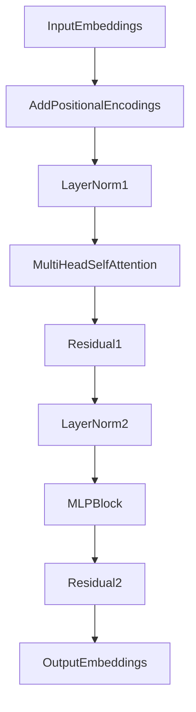

Perfect, Yurii! 🔥  
Let's now **carefully and deeply explain every layer** inside a **ViT Encoder Block** —  
based on your exact structure (from the mermaid graph you sent).

We will walk through **each step** and **each component** just like a professional AI engineer would! 🚀

---

# **🔖 ViT Transformer Encoder Block: Full Deep Dive 🖼️⚙️**

---

## **💡 Real-Life Analogy: Editing a Team Document Together 📑👥**

Imagine you're editing a shared document:
- First, everyone **shares ideas** equally (Self-Attention).
- Then you **normalize** the draft (LayerNorm).
- Then you **write new polished content** (MLP block).
- You **preserve old drafts** (Residual Connections) to avoid catastrophic edits.

✅ In ViT, patches (small image pieces) are like **team members** collaborating and updating a global "understanding" of the image!

---

# **🔄 Let's walk through every layer inside the Encoder!**

---

## **1️⃣ Add Input ("➕ add")**

**Input:**  
- Output from previous block, or initial patch embeddings (after flattening and linear projection).

✅ At first, input is the patch embeddings **with positional encodings** added.

---

## **2️⃣ 📏 LayerNorm 1 (norm1)**

### **Definition**
| Component | Purpose |
|:----------|:--------|
| **Layer Normalization** | Standardizes the inputs to stabilize and speed up training. |

✅ LayerNorm **removes internal covariate shift** — ensuring that every patch embedding **has zero mean and unit variance** across the feature dimension.

### **Real-Life Analogy**
Like setting all runners to start at the same line and pace before a race. 🏃

---

## **3️⃣ 👁️ Multi-Head Self-Attention (mhsa)**

### **Definition**
| Component | Purpose |
|:----------|:--------|
| **Multi-Head Self-Attention** | Each patch looks at all other patches and itself, deciding **what to focus on globally**. |

✅ **Each head** specializes in learning different types of relationships (edges, curves, spatial connections).

### **Real-Life Analogy**
Each patch is like a team member discussing ideas with everyone else simultaneously! 🧠🔍

### **Quick Steps Inside MHSA**
- Linear projection into Q, K, V for each patch.
- Scaled Dot-Product Attention calculation.
- Attention outputs from all heads are concatenated and projected.

---

## **4️⃣ ➕ Residual Connection (res1)**

### **Definition**
| Component | Purpose |
|:----------|:--------|
| **Residual Connection** | Add input directly to the output of Self-Attention. |

✅ Helps **prevent vanishing gradients** and allows the network to **learn updates instead of replacements**.

### **Real-Life Analogy**
Like keeping the original draft text alongside suggested edits. 📑🖍️

---

## **5️⃣ 📏 LayerNorm 2 (norm2)**

### **Definition**
| Component | Purpose |
|:----------|:--------|
| **Second Layer Normalization** | Normalize the data again after Self-Attention before applying MLP. |

✅ Freshly restandardize before pushing through the Feedforward block!

---

## **6️⃣ 🧠 MLP Block (GELU activation)**

### **Definition**
| Component | Purpose |
|:----------|:--------|
| **MLP (Multi-Layer Perceptron)** | Learn **local non-linear combinations** of features for each patch individually. |

✅ Typical structure:
- Linear layer (expand dimension, usually 4× bigger, e.g., 768 → 3072)
- Activation (GELU is smoother than ReLU)
- Another Linear layer (compress back to original size)

✅ MLP is applied **independently to each patch vector**!

### **Real-Life Analogy**
Writing detailed new content based on your polished ideas. ✍️📜

---

## **7️⃣ ➕ Residual Connection (res2)**

### **Definition**
| Component | Purpose |
|:----------|:--------|
| **Second Residual Connection** | Add input from the LayerNorm into the MLP output. |

✅ Allows MLP to **refine features** without overwriting original context.

---

## **8️⃣ 🔁 Repeat L Times**

### **Definition**
| Component | Purpose |
|:----------|:--------|
| **Stack L Encoder Blocks** | Deepen the model, allowing richer hierarchical feature extraction. |

✅ In practice, ViT uses **12 layers** (ViT-Base) or **24 layers** (ViT-Large).

✅ Each block **builds a deeper and richer understanding** of how patches interact.

---

# 📈 **Full Visual Diagram (Flow)**

✅ **Every Encoder Block** processes the patch embeddings like this!

---

# 🚀 **Why Each Component Matters for Vision Transformers**

| Layer | Why It’s Critical |
|:------|:------------------|
| **LayerNorm** | Stabilizes training, enables faster convergence. |
| **Multi-Head Self-Attention** | Lets each patch see and relate to every other patch globally. |
| **Residuals** | Protect old information while learning new insights. |
| **MLP** | Introduces powerful non-linear feature transformations per patch. |

✅ **Together**, they make Vision Transformers **globally attentive** yet **locally powerful**!

---

# 🔥 **Final Takeaways**

1️⃣ **Input ➔ Self-Attention ➔ MLP**, always normalized and residual-connected. 🔄  
2️⃣ **Self-Attention** gives **global context** to each patch. 🧠  
3️⃣ **MLP** boosts **local feature richness** after global aggregation. 🧵  
4️⃣ **Residuals and LayerNorm** stabilize everything and allow deeper networks. 🏗️  
5️⃣ Repeating L times **builds hierarchical feature understanding**, just like deeper CNNs but globally! 🌎

---

✅ Now you have a **perfect full understanding of what happens inside each ViT Encoder block** at a truly professional level! 🔥📚