# The Transformer Attention Mechanism: Enhanced Deep Dive ✨🧠🔍

The attention mechanism is the magical core 🌟 of the Transformer architecture introduced in the landmark "Attention Is All You Need" paper by Vaswani et al. in 2017. This revolutionary component allows models to dynamically focus on different parts of the input sequence, creating a context-aware representation that captures relationships regardless of distance - truly making attention the secret sauce 🔮 behind modern language models!

## ⚙️ Key Components and Process

### 1. Query, Key, Value Projections 🧩
Each input token embedding undergoes three parallel transformations:
- **Query (Q)** 🔍: What the current position is "searching for" in the sequence
- **Key (K)** 🔑: What information each position "offers" or "contains"
- **Value (V)** 💎: The actual content to be gathered based on relevance

### 2. Scaled Dot-Product Attention ⚡
The mathematical magic happens in these steps:
- Compute compatibility scores by taking dot products between queries and all keys 🧮
- Scale scores by dividing by √d_k (preventing gradient vanishing in softmax) 📉
- Apply softmax to transform scores into probability distributions (attention weights) 📊
- Create the contextual representation through weighted summation of values 🧵

### 3. Multi-Head Attention 👑
Rather than placing all attention in one basket:
- The model creates multiple "heads" (typically 8-16) with separate Q,K,V projections 🌈
- Each head learns different relationship patterns (e.g., syntactic vs. semantic) 🔄
- Results from all heads are concatenated and transformed, enriching the representation 🧠

### 4. Types of Attention Interactions 🔄
- **Self-attention** 🪞: When a sequence attends to itself (encoder looking at input)
- **Cross-attention** 🔀: When one sequence attends to another (decoder looking at encoder)

This elegant mechanism enables Transformers to create rich, contextual representations where tokens can "communicate" with all other tokens, regardless of their positions! 🚀

```mermaid
graph TD
    subgraph "✨ Input Processing"
        Input["🔤 Input Embeddings"] --> |Linear Projections| QKV["📊 Query, Key, Value Vectors"]
        QKV -->|Project| Q["🔍 Q (Query)"]
        QKV -->|Project| K["🔑 K (Key)"]
        QKV -->|Project| V["💎 V (Value)"]
    end
    
    subgraph "⚡ Attention Calculation"
        Q --> Dot["🧮 Matrix Multiply (Q·K^T)"]
        K --> Dot
        Dot --> Scale["📏 Scale (÷ √dk)"]
        Scale --> Softmax["📊 Softmax"]
        Softmax --> AttWeights["🎯 Attention Weights"]
        AttWeights --> WeightedSum["🔗 Weighted Sum"]
        V --> WeightedSum
    end
    
    subgraph "🌈 Multi-Head Processing"
        WeightedSum --> H1["👁️ Head 1"]
        WeightedSum --> H2["👁️ Head 2"]
        WeightedSum --> H3["👁️ ..."]
        WeightedSum --> H4["👁️ Head h"]
        H1 --> Concat["🧩 Concatenate"]
        H2 --> Concat
        H3 --> Concat
        H4 --> Concat
        Concat --> Linear["📈 Linear Projection"]
        Linear --> Output["✨ Attention Output"]
    end
    
    subgraph "🔄 Applications"
        Output --> SA["🪞 Self-Attention"]
        Output --> CA["🔀 Cross-Attention"]
    end
    
    classDef blue fill:#0066CC,stroke:#003366,color:white,font-weight:bold;
    classDef green fill:#00CC66,stroke:#009944,color:white,font-weight:bold;
    classDef orange fill:#FF9900,stroke:#CC7A00,color:white,font-weight:bold;
    classDef purple fill:#9933CC,stroke:#662299,color:white,font-weight:bold;
    classDef red fill:#FF5252,stroke:#CC4040,color:white,font-weight:bold;
    
    class Input,Output blue;
    class Q,K,V,QKV green;
    class Dot,Scale,Softmax,AttWeights,WeightedSum orange;
    class H1,H2,H3,H4,Concat,Linear purple;
    class SA,CA red;
```

 🌟 This enhanced Mermaid diagram visualizes the complete Transformer attention flow with emojis highlighting each component's function. It shows the journey from input embeddings through Q/K/V projections, attention calculation with matrix multiplication and scaling, parallel processing across multiple attention heads, and finally how the output feeds both self-attention and cross-attention mechanisms. The color-coding makes the different functional groups easy to distinguish! 🚀

[Diagram explanation] 🌟 This ultra-fancy SVG diagram takes the Transformer attention mechanism to the next level with glowing components, emojis, and decorative elements! It features radial gradients for vibrant component coloring, a mathematical formula at the bottom, and cute sparkles for visual appeal. The flow is enhanced with bold arrows connecting each stage from input embeddings through the attention calculation to multi-head processing and finally showing both self-attention and cross-attention applications. The glow effect around each component makes the diagram pop! ✨🔍🧠

## 🧮 Mathematical Magic Behind Attention

The scaled dot-product attention that powers Transformers can be expressed mathematically as:

$$\text{Attention}(Q, K, V) = \text{softmax}\left(\frac{QK^T}{\sqrt{d_k}}\right)V 🧮$$

Where:
- $Q \in \mathbb{R}^{n \times d_k}$ is the query matrix 🔍
- $K \in \mathbb{R}^{n \times d_k}$ is the key matrix 🔑
- $V \in \mathbb{R}^{n \times d_v}$ is the value matrix 💎
- $d_k$ is the dimension of keys and queries 📏
- $n$ is the sequence length 📊

The scaling factor $\sqrt{d_k}$ is genius - it prevents dot products from growing too large as dimension increases, which would push the softmax function into regions with extremely small gradients (the dreaded vanishing gradient problem! 😱).

## 🚀 Why It's Revolutionary

The attention mechanism is what enables modern language models to:
- Process sequences in parallel rather than sequentially (unlike RNNs) ⚡
- Capture long-range dependencies without information loss 🔗
- Create context-aware representations where every token "sees" every other token 👁️
- Learn different types of linguistic relationships in different heads 🧩

This elegant mechanism is truly the heart and soul of the Transformer revolution that has transformed NLP! 💫🤖🌍