# Vision Transformers (ViT): Enhanced Deep Dive 🖼️🧠✨

Vision Transformers (ViT) represent a revolutionary shift in computer vision by applying transformer architectures—originally designed for NLP—to image processing tasks. Unlike traditional Convolutional Neural Networks (CNNs), ViTs process images as sequences of patches, enabling global context awareness from the very first layer!

## 🔮 Core Concept: Images as Sequences of Patches

The fundamental insight behind ViT is brilliantly simple yet powerful: **treat images as sequences of patches**, similar to how text transformers treat sentences as sequences of tokens. This approach:

- Removes the inductive bias of convolutions (local processing)
- Enables global context from the beginning of processing
- Leverages the proven architecture of transformer encoders
- Scales exceptionally well with data and model size

## ⚙️ Architecture Breakdown

### 1. Patch Extraction & Embedding 🧩
- **Patchify**: Divide the input image (H×W×C) into N=(H×W)/(P×P) non-overlapping patches
- **Flatten**: Convert each P×P×C patch into a 1D vector of length P²×C
- **Linear Projection**: Map each flattened patch to a D-dimensional embedding space

### 2. Position Embedding 📍
- Add learnable position embeddings to patch embeddings
- These are crucial since transformers have no inherent sense of spatial relationships
- Position embeddings preserve information about patch locations

### 3. Class Token Integration 🏷️
- Add a special learnable [CLS] token at the beginning of the sequence
- This token aggregates information from all patches through self-attention
- The final state of this token is used for classification

### 4. Transformer Encoder Blocks 🔄
- Apply standard transformer encoder blocks with:
  - Multi-head self-attention (each patch attends to all others)
  - MLP blocks with GELU activations
  - Layer normalization and residual connections
- No convolutions anywhere in the architecture!

### 5. MLP Head 🎯
- Take the output of the [CLS] token after the final transformer block
- Pass it through a simple MLP for final classification

```mermaid
flowchart TD
    subgraph "🖼️ Image Processing"
        img["🌄 Input Image\n(H×W×C)"] --> split["✂️ Split into Patches\n(N patches of size P×P)"]
        split --> flatten["📄 Flatten Patches\n(P²×C dimensions)"]
        flatten --> project["📊 Linear Projection\n(D dimensions)"]
    end
    
    subgraph "🧩 Sequence Creation"
        project --> embed["💫 Patch Embeddings"]
        cls["🏷️ Class Token\n[CLS]"] --> concat["🔗 Concatenate"]
        embed --> concat
        pos["📍 Position\nEmbeddings"] --> add["➕ Add"]
        concat --> add
    end
    
    subgraph "🔄 Transformer Encoder"
        add --> norm1["📏 Layer Norm"]
        norm1 --> mhsa["👁️ Multi-Head\nSelf-Attention"]
        mhsa --> res1["➕ Residual\nConnection"]
        add --> res1
        res1 --> norm2["📏 Layer Norm"]
        norm2 --> mlp["🧠 MLP Block\nGELU"]
        mlp --> res2["➕ Residual\nConnection"]
        res1 --> res2
        
        res2 -->|"Repeat L times"| norm1
    end
    
    subgraph "🎯 Classification"
        res2 --> extract["📌 Extract [CLS]\nToken"]
        extract --> mlp_head["🧠 MLP Head"]
        mlp_head --> out["🏆 Class\nPrediction"]
    end
    
    classDef blue fill:#4285F4,stroke:#2956A8,color:white,font-weight:bold;
    classDef green fill:#34A853,stroke:#227735,color:white,font-weight:bold;
    classDef yellow fill:#FBBC05,stroke:#B08C04,color:white,font-weight:bold;
    classDef red fill:#EA4335,stroke:#B7271F,color:white,font-weight:bold;
    classDef purple fill:#9C27B0,stroke:#6A1B9A,color:white,font-weight:bold;
    
    class img,split,flatten,project blue;
    class cls,concat,pos,add green;
    class norm1,mhsa,res1,norm2,mlp,res2 yellow;
    class extract,mlp_head,out red;
```



🌟 This Mermaid flowchart illustrates the complete Vision Transformer pipeline in vibrant colors. It shows how an input image is processed through four main stages: (1) Image Processing (blue) where the image is split into patches, flattened, and projected; (2) Sequence Creation (green) where the patch embeddings are combined with a class token and position embeddings; (3) Transformer Encoder (yellow) showing the attention mechanism with layer normalization and residual connections; and (4) Classification (red) where the class token is extracted and fed through an MLP head for final prediction.

[Diagram explanation] 🌟 This comprehensive SVG diagram illustrates the Vision Transformer architecture with vibrant gradients and detailed components. It shows the complete flow from input image (224×224×3) through patch extraction (16×16 patches), linear projection (768-dimensional embeddings), position encoding and class token addition, followed by the transformer encoder with multi-head attention and MLP blocks. The diagram highlights the key mathematical components, includes visual representations of the image-to-patches process, and shows how the class token flows through the network for final classification. Decorative elements and formulas enhance understanding of the architecture's mathematical foundations. ✨

## 🔬 Key Technical Innovations in ViT

### 1. Efficient Patch Embedding 🧩
- Standard implementation uses a convolution with kernel size=stride=patch size
- This efficiently splits, flattens and projects patches in one operation
- Example: Conv2d(in_channels=3, out_channels=768, kernel_size=16, stride=16)

### 2. Position Encoding Approaches 📍
- **Learned absolute position embeddings**: Most common in original ViT
- **Relative position embeddings**: Used in improved variants
- **Explicit 2D awareness**: Some versions encode row/column positions separately

### 3. Hybrid Architectures 🔄
- ResNet stem → Transformer encoder
- Local attention → Global attention
- Hierarchical transformers (e.g., Swin Transformer)

### 4. Pre-training Strategies 🧠
- **Supervised pre-training**: Original ViT approach (on JFT-300M)
- **Self-supervised pre-training**: MAE, BEiT, DINO
- **Contrastive learning**: Used in many modern variants

## 💡 Advantages Over CNNs

1. **Global Context**: Every patch can attend to every other patch in the very first layer
2. **Scalability**: Performance scales very well with more data and larger models
3. **Transfer Learning**: Pre-trained ViTs transfer exceptionally well across tasks
4. **Flexibility**: Can handle variable input sizes with minimal adaptations
5. **Unified Architecture**: Same core architecture for vision, language, and multimodal tasks

## 🔍 Limitations & Challenges

1. **Data Hunger**: Requires more data than CNNs to reach comparable performance
2. **Computational Cost**: Self-attention is O(n²) with sequence length
3. **Position Encoding**: Lacks the spatial inductive bias of convolutions
4. **Resolution Constraints**: Higher resolutions dramatically increase patch count

## 🚀 Recent Advances Beyond Basic ViT

1. **DeiT**: Data-efficient training techniques
2. **BEiT**: BERT-style masked image modeling
3. **Swin Transformer**: Hierarchical structure with window-based attention
4. **MAE**: Masked autoencoder for self-supervised learning
5. **ViTDet**: Adapting ViT for object detection
6. **Segment Anything**: Foundation model for segmentation based on ViT

## 🧠 Mathematical Expression of Patch Embedding

Given an input image `x ∈ ℝ^(H×W×C)` with height H, width W, and C channels:

1. Image is split into N patches: `N = HW/P²` where P is patch size
2. Each patch is flattened: `x_p ∈ ℝ^(N×(P²·C))`
3. Linear projection to embedding dimension: `E = x_p · W_E` where `W_E ∈ ℝ^((P²·C)×D)`
4. Add position embeddings: `z_0 = [x_class; E_1; E_2; ...; E_N] + E_pos`
5. Feed through transformer: `z_L = Transformer(z_0)`
6. Classification: `y = MLP(LN(z_L^0))` (using first token z_L^0)

## 💻 Sample PyTorch Implementation Highlights

```python
# Patch embedding via convolution
self.patch_embed = nn.Conv2d(
    in_channels=3,
    out_channels=embed_dim,
    kernel_size=patch_size,
    stride=patch_size
)

# Class token
self.cls_token = nn.Parameter(torch.zeros(1, 1, embed_dim))

# Position embeddings
self.pos_embed = nn.Parameter(torch.zeros(1, num_patches + 1, embed_dim))

# Transformer encoder
self.transformer = nn.TransformerEncoder(
    encoder_layer=nn.TransformerEncoderLayer(
        d_model=embed_dim,
        nhead=num_heads,
        dim_feedforward=mlp_dim,
        dropout=dropout
    ),
    num_layers=num_layers
)

# Classification head
self.head = nn.Linear(embed_dim, num_classes)
```

## 🔮 Future Directions

1. **Efficiency Improvements**: Reducing computational complexity beyond O(n²)
2. **Multimodal Integration**: Unifying vision, language, and other modalities
3. **Foundation Models**: Large pre-trained vision models analogous to LLMs
4. **Dynamic Architectures**: Adaptive computation based on input complexity
5. **Hierarchical Representations**: Better combining local and global information

Vision Transformers have fundamentally changed how we approach computer vision problems, moving from local convolutional processing to global attention-based mechanisms, and opening exciting new directions for research and applications! 🚀✨