# Vision Transformer Training Tricks & Optimization 🎯🧠✨

While the Vision Transformer architecture is revolutionary, its lack of inductive biases compared to CNNs requires special training techniques to reach state-of-the-art performance, especially when working with limited data. Let's dive into these essential tricks that transform ViT from a data-hungry model into a versatile vision backbone!

## 📊 The Training Challenge

Vision Transformers face several unique challenges:
- No built-in local processing bias (unlike CNNs with their convolutional inductive bias)
- High susceptibility to overfitting on smaller datasets
- Unstable early training dynamics due to random initialization of attention
- Require special optimization care to reach their full potential

The good news? With the right training approaches, ViTs can match or surpass CNNs even on modestly sized datasets!

```mermaid
flowchart TD
    subgraph "🖼️ Data Enhancement"
        raw["🌄 Raw Images"] --> aug["✨ Data Augmentation"]
        aug --> mix["🔀 Mixup/CutMix"]
    end
    
    subgraph "🧠 Training Process"
        mix --> vit["🔍 ViT Model"]
        teacher["👨‍🏫 CNN Teacher\n(Optional)"] -.-> distill["📚 Knowledge\nDistillation"]
        vit --> distill
        distill --> loss["📉 Loss Function\n+ Label Smoothing"]
    end
    
    subgraph "⚙️ Optimization"
        loss --> warm["🔥 Learning Rate\nWarmup"]
        warm --> cosine["📈 Cosine LR\nSchedule"]
        cosine --> adamw["⚡ AdamW\nOptimizer"]
    end
    
    subgraph "🛡️ Regularization"
        reg1["🎭 Dropout"] --> vit
        reg2["🔀 Stochastic Depth\n(DropPath)"] --> vit
        adamw --> wd["⚖️ Weight Decay"]
    end
    
    wd --> trained["✅ Trained ViT"]
    
    classDef blue fill:#4285F4,stroke:#2956A8,color:white,font-weight:bold;
    classDef green fill:#34A853,stroke:#227735,color:white,font-weight:bold;
    classDef yellow fill:#FBBC05,stroke:#B08C04,color:white,font-weight:bold;
    classDef red fill:#EA4335,stroke:#B7271F,color:white,font-weight:bold;
    classDef purple fill:#9C27B0,stroke:#6A1B9A,color:white,font-weight:bold;
    
    class raw,aug,mix blue;
    class vit,distill,loss green;
    class warm,cosine,adamw yellow;
    class reg1,reg2,wd red;
    class trained,teacher purple;
```



[Diagram explanation] 🌟 This Mermaid flowchart illustrates the complete Vision Transformer training pipeline with all critical optimization tricks. It shows four key component groups: (1) Data Enhancement (blue) with augmentation and mixing strategies, (2) Training Process (green) including optional knowledge distillation from CNN teachers, (3) Optimization (yellow) showing the learning rate schedule and AdamW optimizer, and (4) Regularization (red) including dropout, stochastic depth, and weight decay. All components flow together to produce a well-trained ViT (purple).

[Diagram explanation] 🌟 This comprehensive SVG diagram illustrates key Vision Transformer training techniques organized in four main categories. The top sections show Data Augmentation strategies (blue gradient boxes) including Random Crop, Flip, Color Jitter and Mixup/CutMix alongside Regularization Techniques (red gradient boxes) such as Dropout, Stochastic Depth, Label Smoothing, and Weight Decay. The bottom sections display Optimization Techniques (yellow gradient) including AdamW Optimizer, Learning Rate Warmup and a visualized Cosine LR Schedule, alongside Knowledge Distillation showing the flow from a CNN teacher to a ViT student. A simple bar chart visualizes the relative effectiveness of each technique category. ✨

## ⚡ Key Training Tricks for Vision Transformers

### 1. Data Augmentation Strategies 🖼️

Data augmentation is particularly critical for Vision Transformers since they lack the inductive biases of CNNs:

| Technique | Implementation | Effect |
|:----------|:---------------|:-------|
| **Random Crop & Resize** | Crop image to random size (0.08-1.0 of original), then resize to target | Teaches scale and position invariance |
| **Random Horizontal Flip** | 50% chance to mirror image horizontally | Adds left-right variation |
| **Color Jitter** | Randomly vary brightness, contrast, saturation | Teaches color invariance |
| **Mixup** | Blend two images and their labels: λ·x₁ + (1-λ)·x₂ | Creates smooth decision boundaries |
| **CutMix** | Cut rectangular region from one image and paste into another | Teaches feature robustness |
| **RandAugment** | Apply sequence of randomly selected augmentations | Diverse transformations |

The DeiT paper (Data-efficient Image Transformers) showed that strong augmentation is **critical** to make ViT competitive with CNNs on ImageNet-scale datasets.

### 2. Regularization Techniques 🛡️

These techniques prevent ViT from overfitting:

| Technique | Implementation | Effect |
|:----------|:---------------|:-------|
| **Dropout** | Standard dropout on attention outputs and MLPs | Prevents co-adaptation |
| **Stochastic Depth (DropPath)** | Randomly drop entire transformer layers during training | Shortens effective depth |
| **Label Smoothing** | Mix one-hot labels with uniform distribution | Prevents overconfidence |
| **Weight Decay** | L2 penalty on weights (properly implemented in AdamW) | Controls weight magnitude |

ViTs typically use stronger regularization than CNNs, with dropout rates around 0.1-0.3 and stochastic depth rates up to 0.2 for deeper models.

### 3. Optimization Techniques ⚙️

Careful optimization is crucial for ViT training stability:

| Technique | Implementation | Effect |
|:----------|:---------------|:-------|
| **AdamW Optimizer** | Adam with decoupled weight decay | Better generalization |
| **Learning Rate Warmup** | Linear increase from 0 to max LR over first epochs (typically 5-10% of training) | Stabilizes early training |
| **Cosine Learning Rate Schedule** | LR follows cosine curve from max to zero | Smooth decay, better convergence |
| **Layer-wise LR Decay** | Apply smaller LR to earlier layers | Stabilizes pre-trained models |

The learning rate warmup is particularly important for ViT, as the self-attention weights are unstable early in training.

### 4. Advanced Techniques 🔍

These techniques take ViT performance even further:

| Technique | Implementation | Effect |
|:----------|:---------------|:-------|
| **Knowledge Distillation** | Use a trained CNN teacher (e.g., RegNetY-16GF) | Transfers inductive biases |
| **Token Distillation** | Add distillation token alongside class token | Dedicated learning from teacher |
| **Smaller Patch Size** | 8×8 patches instead of 16×16 | More fine-grained features |
| **EMA (Exponential Moving Average)** | Maintain running average of model weights | Stabilizes training |

## 📊 Performance Impact

The impact of these techniques is dramatic. For example, on ImageNet-1K:

| Model | Training Tricks | Top-1 Accuracy |
|:------|:----------------|:---------------|
| ViT-B/16 | Standard (JFT-300M pretraining) | 77.9% |
| ViT-B/16 | Standard (ImageNet only) | 74.5% |
| DeiT-B/16 | Full tricks suite | 81.8% |
| DeiT-B/16 | + Distillation | 83.4% |

This shows how proper training techniques can eliminate the need for massive pre-training datasets like JFT-300M!

## 💻 PyTorch Implementation Example

Here's a simplified example showing how to implement some key ViT training tricks:

```python
import torch
import torch.nn as nn
import torchvision.transforms as transforms
from timm.loss import LabelSmoothingCrossEntropy, SoftTargetCrossEntropy
from timm.data.mixup import Mixup
from timm.scheduler.cosine_lr import CosineLRScheduler

# 1. Strong Data Augmentation
transform_train = transforms.Compose([
    transforms.RandomResizedCrop(224, scale=(0.08, 1.0)),
    transforms.RandomHorizontalFlip(),
    transforms.ColorJitter(0.4, 0.4, 0.4, 0.1),
    transforms.ToTensor(),
    transforms.Normalize(mean=[0.485, 0.456, 0.406], 
                         std=[0.229, 0.224, 0.225])
])

# 2. Mixup and CutMix
mixup_fn = Mixup(
    mixup_alpha=0.8, cutmix_alpha=1.0, cutmix_minmax=None,
    prob=0.65, switch_prob=0.5, mode='batch',
    label_smoothing=0.1, num_classes=1000
)

# 3. Label Smoothing Loss
criterion = LabelSmoothingCrossEntropy(smoothing=0.1)

# 4. AdamW Optimizer
optimizer = torch.optim.AdamW(
    model.parameters(),
    lr=5e-4,
    weight_decay=0.05
)

# 5. Learning Rate Scheduler with Warmup
lr_scheduler = CosineLRScheduler(
    optimizer,
    t_initial=100,  # epochs
    lr_min=1e-5,
    warmup_t=5,     # 5 epochs warmup
    warmup_lr_init=1e-6
)

# 6. Stochastic Depth
def drop_path(x, drop_prob=0.0, training=False):
    if drop_prob == 0. or not training:
        return x
    keep_prob = 1 - drop_prob
    shape = (x.shape[0],) + (1,) * (x.ndim - 1)
    random_tensor = keep_prob + torch.rand(shape, dtype=x.dtype, device=x.device)
    random_tensor.floor_()  # binarize
    output = x.div(keep_prob) * random_tensor
    return output
```

## 🧠 Knowledge Distillation: The Secret Weapon

Knowledge distillation deserves special attention as it's a critical technique for ViT training:

1. **How it Works**: A pre-trained CNN (teacher) generates soft probability distributions that the ViT (student) learns from
2. **DeiT Implementation**: Adds a dedicated distillation token alongside the class token
3. **Loss Function**: Combines classification loss and distillation loss
4. **Teacher Models**: RegNetY-16GF or EfficientNet-B7 work well as teachers

This approach elegantly transfers the inductive biases from CNNs to ViTs, giving "the best of both worlds."

## 🚀 Advanced Optimization Insights

Some nuanced details that make a big difference:

- **Layer-wise LR Decay**: Lower learning rates for earlier layers (when fine-tuning)
- **Gradient Clipping**: Values around 1.0 help prevent exploding gradients
- **BatchNorm Momentum**: Adjusted to 0.1 for stability in larger batch sizes
- **Mixed Precision Training**: Using FP16 accelerates training with minimal accuracy loss
- **Optimal Batch Size**: Larger batches (512-4096) work better for ViT with proper scaling

## 🔍 Conclusion: The Art of ViT Training

Vision Transformers represent a paradigm shift in computer vision, but they require careful training techniques to reach their full potential. By combining strong data augmentation, proper regularization, careful optimization, and knowledge distillation, ViTs can not only match but exceed the performance of CNNs.

The most exciting part? These techniques continue to evolve, with each new paper pushing the boundaries of what's possible with vision transformers. The next generation of ViTs (like Swin Transformer, MViT, and CoAtNet) build on these foundations while addressing remaining challenges like efficiency and multi-scale processing.